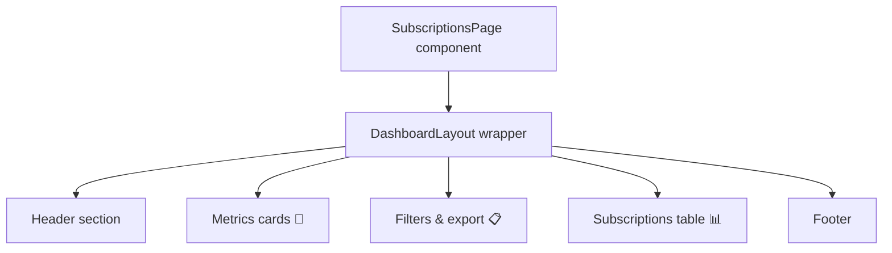

# Subscription Management Page

This file defines the **SubscriptionsPage** component under `app/dashboard/admin/subscriptions/page.tsx`. It renders a subscription management interface within the admin dashboard, featuring key metrics, filters, and a detailed subscriptions table.  

```jsx
// Key imports from UI library and dashboard layout
import { DashboardLayout } from "@/components/dashboard-layout"
import { Card, CardHeader, CardContent, CardTitle, CardDescription } from "@/components/ui/card"
import { Button } from "@/components/ui/button"
import { Input } from "@/components/ui/input"
import { Badge } from "@/components/ui/badge"
import { Search, Download, TrendingUp } from "lucide-react"
import { Table, TableHeader, TableBody, TableRow, TableHead, TableCell } from "@/components/ui/table"
import { Select, SelectTrigger, SelectValue, SelectContent, SelectItem } from "@/components/ui/select"
```

---

## Overview

SubscriptionsPage is a **Next.js App Router** page component. It wraps content in a consistent layout (`DashboardLayout`) and provides:

- A **header** with page title and description.
- A **metrics section** summarizing subscription KPIs.
- A **filter bar** with search, status/plan selectors, and export action.
- A **data table** listing individual subscriptions.
- A **footer** with copyright.

---

## Component Hierarchy



---

## Header

A simple banner introducing the page:

- **Title**: Subscription Management
- **Description**: Manage all customer subscriptions, plans, and their states  

```jsx
<div>
  <h1 className="text-3xl font-bold text-slate-900">Subscription Management</h1>
  <p className="text-slate-600 mt-1">
    Manage all customer subscriptions, plans, and their states
  </p>
</div>
```

---

## Metrics Cards 🎯

Displays four key subscription metrics in responsive cards:

| Metric                          | Value     | Trend             |
|---------------------------------|-----------|-------------------|
| **Total Active Subscriptions**  | 6         | +5% last month    |
| **Monthly Recurring Revenue**   | $369.94   | +2.3% last month  |
| **Cancelled Subscriptions**     | 1         | 0.8% decrease     |
| **New Subscriptions**           | 3         | +3 last month     |

Each card uses the `Card`, `CardHeader`, `CardTitle`, and `CardContent` primitives for consistent styling.

---

## Filters & Export 📋

Allows admins to quickly find and export subscription data:

```jsx
<div className="flex flex-col md:flex-row gap-3 mt-4">
  <div className="relative flex-1">
    <Search className="absolute left-3 top-1/2 h-4 w-4 text-slate-400" />
    <Input placeholder="Search subscriptions..." className="pl-10" />
  </div>

  <Select defaultValue="all">
    <SelectTrigger className="w-full md:w-40">
      <SelectValue placeholder="All Statuses" />
    </SelectTrigger>
    <SelectContent>
      <SelectItem value="all">All Statuses</SelectItem>
      <SelectItem value="active">Active</SelectItem>
      <SelectItem value="pending">Pending</SelectItem>
      <SelectItem value="cancelled">Cancelled</SelectItem>
      <SelectItem value="suspended">Suspended</SelectItem>
    </SelectContent>
  </Select>

  <Select defaultValue="all-plans">
    <SelectTrigger className="w-full md:w-40">
      <SelectValue placeholder="All Plans" />
    </SelectTrigger>
    <SelectContent>
      <SelectItem value="all-plans">All Plans</SelectItem>
      <SelectItem value="enterprise">Enterprise</SelectItem>
      <SelectItem value="pro">Pro</SelectItem>
      <SelectItem value="basic">Basic</SelectItem>
    </SelectContent>
  </Select>

  <Button variant="outline">
    <Download className="h-4 w-4 mr-2" /> Export Data
  </Button>
</div>
```

---

## Subscriptions Table 📊

Renders a scrollable table of subscription records:

- **Columns**: Customer Name, Email, Plan, Status, Start Date, End Date, Monthly Price, Actions  
- **Badges**: Color-coded for plan and status  
- **Actions**: “Manage” button per row  

```jsx
<Table>
  <TableHeader>
    <TableRow className="bg-slate-50">
      <TableHead>Customer Name</TableHead>
      <TableHead>Email</TableHead>
      <TableHead>Plan</TableHead>
      <TableHead>Status</TableHead>
      <TableHead>Start Date</TableHead>
      <TableHead>End Date</TableHead>
      <TableHead>Monthly Price</TableHead>
      <TableHead>Actions</TableHead>
    </TableRow>
  </TableHeader>
  <TableBody>
    {subscriptions.map((sub, idx) => (
      <TableRow key={idx} className="hover:bg-slate-50">
        <TableCell className="font-medium">{sub.customer}</TableCell>
        <TableCell className="text-sm text-slate-600">{sub.email}</TableCell>
        <TableCell>
          <Badge variant="secondary" className={/* color logic */}>
            {sub.plan}
          </Badge>
        </TableCell>
        <TableCell>
          <Badge variant="secondary" className={/* color logic */}>
            {sub.status}
          </Badge>
        </TableCell>
        <TableCell className="text-sm">{sub.startDate}</TableCell>
        <TableCell className="text-sm">{sub.endDate}</TableCell>
        <TableCell className="font-medium">{sub.monthlyPrice}</TableCell>
        <TableCell>
          <Button variant="outline" size="sm">Manage</Button>
        </TableCell>
      </TableRow>
    ))}
  </TableBody>
</Table>
```

---

## Data Source

This page currently uses a **static** mock array for demo purposes:

```js
const subscriptions = [
  {
    customer: "Acme Corp",
    email: "acme@example.com",
    plan: "Enterprise",
    status: "Active",
    startDate: "2023-01-01",
    endDate: "2024-01-01",
    monthlyPrice: "$99.99",
  },
  // …more entries
]
```

```card
{
  "title": "Note",
  "content": "Subscriptions data is currently static. Integrate an API call in production to fetch dynamic data."
}
```

---

## Dependencies 🔗

- **DashboardLayout**: Core layout with sidebar and header  
  (see implementation in `components/dashboard-layout.tsx` )  
- **UI Primitives**:  
  - Cards: `Card`, `CardHeader`, `CardTitle`, `CardContent`, `CardDescription`  
  - Button: `Button`  
  - Input: `Input`  
  - Badge: `Badge`  
  - Table: `Table`, `TableHeader`, `TableBody`, `TableRow`, `TableHead`, `TableCell`  
  - Select: `Select`, `SelectTrigger`, `SelectValue`, `SelectContent`, `SelectItem`  
- **Icons**: `Search`, `Download`, `TrendingUp` from **lucide-react**

---

## Footer

A simple centralized footer marks the end of the page:

```jsx
<p className="text-center text-sm text-slate-500 pt-6 border-t border-slate-200">
  © 2025 Pinnacle GST Analytical Dashboard. All rights reserved.
</p>
```

---