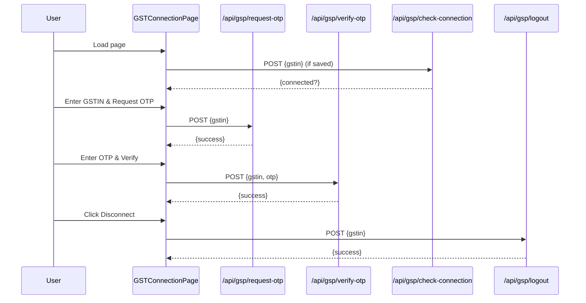

# GST Connection Page  
The **GST Connection** page enables users to securely link their GSTIN to the Alankit GST Sandbox API. It guides users through entering their GSTIN, requesting an OTP, verifying the OTP, and managing the connected session. This page lives at `app/dashboard/gst-connection/page.tsx` .

---

## 🚀 Overview  
This React component handles:
- **Session check** on mount to auto-detect existing connections  
- **GSTIN input** and OTP request flow  
- **OTP verification** for authentication  
- **Connected state** display with session details and disconnect option  

It leverages Next.js client-side features (`"use client"`), shadcn/ui components, and custom API routes under `/api/gsp/*`.

---

## 🔗 Imports & Dependencies  
- **Layout**  
  - `DashboardLayout` wraps content within the main dashboard UI .  
- **UI Components** (from `@/components/ui`)  
  - Card: `Card`, `CardHeader`, `CardTitle`, `CardDescription`, `CardContent`  
  - Form: `Input`, `Label`, `Button`  
  - Status: `Badge`  
- **Icons** (from `lucide-react`)  
  - `CheckCircle`, `LinkIcon`, `AlertCircle`, `Lock`  
- **Hooks**  
  - `useState`, `useEffect` for state & lifecycle .

---

## 🗄️ State Management  
```tsx
const [step, setStep] = useState<"gstin"|"otp"|"connected">("gstin")
const [gstin, setGstin] = useState<string>("")
const [otp, setOtp] = useState<string>("")
const [isLoading, setIsLoading] = useState<boolean>(false)
const [error, setError] = useState<string>("")
const [isCheckingConnection, setIsCheckingConnection] = useState<boolean>(false)
```
- **step**: current UI stage (`gstin`, `otp`, `connected`)  
- **gstin** & **otp**: user inputs  
- **isLoading**: API call in progress  
- **error**: error message display  
- **isCheckingConnection**: initial session validation  

---

## ⏳ Initial Session Check  
On mount, the component checks for a saved GSTIN in `localStorage`. If found, it calls `/api/gsp/check-connection` to validate the session.  
```tsx
useEffect(() => {
  const checkExistingConnection = async () => {
    const savedGstin = localStorage.getItem("connected_gstin")
    if (!savedGstin) return
    setIsCheckingConnection(true)
    try {
      const res = await fetch("/api/gsp/check-connection", { method:"POST", body: JSON.stringify({ gstin: savedGstin }) })
      const data = await res.json()
      if (data.success && data.connected) {
        setGstin(savedGstin)
        setStep("connected")
      } else {
        localStorage.removeItem("connected_gstin")
      }
    } catch {
      localStorage.removeItem("connected_gstin")
    } finally {
      setIsCheckingConnection(false)
    }
  }
  checkExistingConnection()
}, [])
```  
This ensures users remain logged in across page reloads .

---

## ⚙️ Event Handlers  

1. **Request OTP**  
   Sends GSTIN to `/api/gsp/request-otp` and advances to OTP form on success.  
   ```tsx
   const handleRequestOtp = async (e) => { … await fetch("/api/gsp/request-otp", { … }) … }
   ```  
   Endpoint logic: Validates format, generates AppKey, stores it in Redis .

2. **Verify OTP**  
   Submits GSTIN + OTP to `/api/gsp/verify-otp`. On success, stores GSTIN in `localStorage` and shows connected state.  
   ```tsx
   const handleVerifyOtp = async (e) => { … await fetch("/api/gsp/verify-otp", { … }) … }
   ```  
   Endpoint logic: Retrieves AppKey from Redis, decrypts SEK, stores auth token & SEK .

3. **Disconnect**  
   Calls `/api/gsp/logout`, clears local storage, and resets state.  
   ```tsx
   const handleDisconnect = async () => { await fetch("/api/gsp/logout", { … }); … }
   ```  
   Endpoint logic: Terminates session in Redis and at GSP .

---

## 🖥️ Rendering Logic  
```tsx
if (isCheckingConnection) return <LoadingSpinner />
return (
  <DashboardLayout>
    {step === "gstin" && <GSTINForm />}
    {step === "otp" && <OTPForm />}
    {step === "connected" && <ConnectedView />}
  </DashboardLayout>
)
```  
### 1. GSTIN Entry  
- 15-character GSTIN input  
- “Request OTP” button (disabled until valid)  
- Security & sandbox info panels   

### 2. OTP Verification  
- 6-digit OTP input  
- “Back” & “Verify OTP” buttons  
- Error display on failure   

### 3. Connected State  
- Success badge & GSTIN details  
- Session status & environment info  
- “Disconnect” & “View Dashboard” actions   

---

## 📡 API Endpoints  
| Endpoint                      | Method | Description                                    |
|-------------------------------|:------:|------------------------------------------------|
| `/api/gsp/request-otp`        |  POST  | Initiates OTP: generates AppKey & sends OTP    |
| `/api/gsp/verify-otp`         |  POST  | Verifies OTP & decrypts SEK                    |
| `/api/gsp/check-connection`   |  POST  | Checks active session for given GSTIN          |
| `/api/gsp/logout`             |  POST  | Logs out and clears session                   |
| `/api/gsp/refresh-token`      |  POST  | Refreshes auth token without full re-auth      |

---

## 🔀 Interaction Flow  


---

## 📁 Related Files & Architecture  
- **components/dashboard-layout.tsx**: Main wrapper with sidebar & responsive menu   
- **lib/alankit-gst-api.ts**: Crypto + API helper functions (AppKey/SEK management)   
- **lib/redis.ts**: Redis client exposing `storeGstSession`, `getGstSession`, `storeGstAuth`, `getGstAuth`, `deleteGstSession`  
- **app/api/gsp/**: Route handlers orchestrating OTP flow, session check, logout, token refresh  

---

## 🔑 Key Takeaways  
```card
{
  "title": "Secure Flow",
  "content": "All sensitive keys are stored in Redis with TTL; no secrets in client storage."
}
```  
- **Short-lived AppKey** (5 min) for OTP request  
- **SEK & Auth Token** stored (6 hours) for payload encryption  
- **Local Storage** only holds GSTIN, not keys  

This documentation covers the **GST Connection** page and its integration with backend services, ensuring a clear understanding of its purpose and underlying architecture.