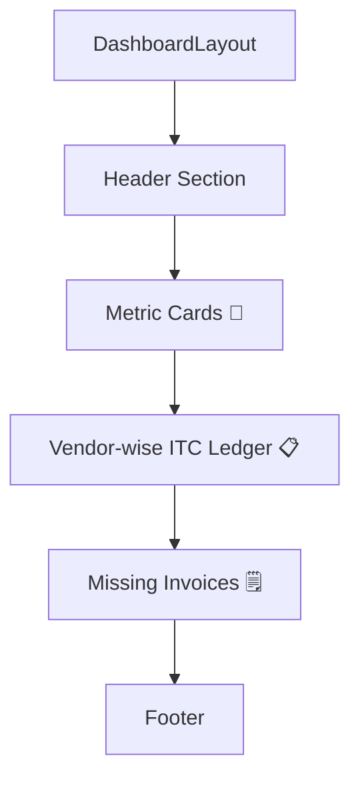

# Input Tax Credit (ITC) Page  
**File:** `app/dashboard/itc/page.tsx`  

This Next.js page delivers a comprehensive **Input Tax Credit Analytics** dashboard. Wrapped in a global `DashboardLayout`, it presents:

- High-level ITC metrics  
- A vendor-wise ITC ledger  
- A table of missing invoices  

All UI elements leverage the project’s design system components: **Card**, **Button**, **Badge**, and **Table**.  
  
---

## Overview  
The ITC page helps users monitor and optimize their GST Input Tax Credit. It highlights:  
- **Availability** vs **claimed** amounts  
- **Mismatches** and **ineligible** credits  
- Outstanding **missing invoices**  
- Detailed vendor breakdown  

Rendered under the standard sidebar layout, it ensures a consistent experience across the dashboard .  

---

## Dependencies  
- **DashboardLayout**: global frame with navigation   
- **Card**, **CardHeader**, **CardTitle**, **CardDescription**, **CardContent**: container components   
- **Button**: styled action trigger   
- **Badge**: status label   
- **Table**, **TableHeader**, **TableHead**, **TableBody**, **TableRow**, **TableCell**: tabular layout  
- **Icons** (`Download`, `Eye`, `FileText`): lucide-react  

---

## Data Models 📑  

### ITC Metrics Array  
| Property    | Type    | Description                                 |
|-------------|---------|---------------------------------------------|
| **title**       | string  | Card heading (e.g., “ITC Available”)        |
| **value**       | string  | Numeric display (formatted with ₹)         |
| **description** | string  | Tooltip-like detail under the value        |
| **color**       | string  | Tailwind gradient classes for the card BG |

<details>
<summary>Example Entry</summary>

```js
{
  title: "ITC Available",
  value: "₹2,345,678",
  description: "Total eligible ITC for the period",
  color: "from-blue-50 to-blue-100",
}
```
</details>

### Vendor Ledger Array  
| Field            | Type   | Description                           |
|------------------|--------|---------------------------------------|
| **vendor**           | string | Vendor name                          |
| **gstin**            | string | Vendor GST Identification Number     |
| **totalItc**         | string | Total ITC billed                     |
| **eligibleItc**      | string | Claimable ITC                        |
| **ineligibleItc**    | string | Disallowed ITC                       |

### Missing Invoices Array  
| Field             | Type   | Description                                 |
|-------------------|--------|---------------------------------------------|
| **invoiceNumber**    | string | Unique invoice identifier                   |
| **vendorGstin**      | string | GSTIN of the issuing vendor                 |
| **invoiceDate**      | string | Date of invoice                              |
| **itcAmount**        | string | Claimed ITC value                            |
| **status**           | string | “Missing” | “Pending Verification” | “Resolved” |

---

## Layout & Composition  


1. **Header Section**  
   A page title and description introduce the ITC context.  
   ```jsx
   <div>
     <h1 className="text-3xl font-bold text-slate-900">
       Input Tax Credit Analytics
     </h1>
     <p className="text-slate-600 mt-1">
       Comprehensive overview and detailed breakdown of your Input Tax Credit...
     </p>
   </div>
   ```  

2. **Metric Cards 🎯**  
   A responsive grid (`grid-cols-1 md:grid-cols-2 lg:grid-cols-5`)  
   iterates over `itcMetrics` to render summary cards:
   ```jsx
   <div className="grid ...">
     {itcMetrics.map(metric => (
       <Card key={metric.title} className={`bg-gradient-to-br ${metric.color}`}>
         <CardHeader>
           <CardTitle>{metric.title}</CardTitle>
         </CardHeader>
         <CardContent>
           <div className="text-2xl font-bold">{metric.value}</div>
           <p className="text-xs">{metric.description}</p>
         </CardContent>
       </Card>
     ))}
   </div>
   ```
   Each card highlights a distinct KPI.   

3. **Vendor-wise ITC Ledger 📋**  
   - Wrapped in a `Card` with **CSV**, **Excel**, **PDF** download buttons.  
   - A table lists each vendor’s ITC breakdown.  
   - An **Eye** icon button hints at deeper drill-down.  
   ```jsx
   <Table>
     <TableHeader> ... </TableHeader>
     <TableBody>
       {vendorLedger.map(vendor => (
         <TableRow key={vendor.gstin}>
           <TableCell>{vendor.vendor}</TableCell>
           <!-- ... -->
           <Button variant="ghost"><Eye /></Button>
         </TableRow>
       ))}
     </TableBody>
   </Table>
   ```  

4. **Missing Invoices 🗒️**  
   - Shows invoices not reflected in GSTR-2A.  
   - **Badge** indicates status with color coding:
     - **Red** for Missing  
     - **Yellow** for Pending  
     - **Green** for Resolved  
   ```jsx
   <TableRow>
     <TableCell>{invoice.invoiceNumber}</TableCell>
     <!-- ... -->
     <Badge
       variant={invoice.status === "Resolved" ? "default" : "secondary"}
       className={/* conditional bg/text */}>
       {invoice.status}
     </Badge>
     <Button variant="ghost"><FileText /></Button>
   </TableRow>
   ```  

5. **Footer**  
   A centered copyright:
   ```jsx
   <p className="text-center text-sm text-slate-500 pt-6 border-t">
     © 2025 Pinnacle GST Analytical Dashboard. All rights reserved.
   </p>
   ```  

---

## Key Patterns & Design Decisions  
- **Declarative Data Mapping**: All UI lists derive directly from hardcoded arrays, simplifying maintenance.  
- **Consistent Theming**: Shared UI primitives from `@/components/ui` ensure uniform spacing, typography, and color.  
- **Adaptive Grid**: Tailwind’s responsive classes guarantee mobile-first behavior.  
- **Icon-enhanced Actions**: Lucide icons paired with buttons improve affordance.  

---

## Usage & Integration  
- **Route**: `/dashboard/itc` in Next.js App Router.  
- **Authentication**: Assumes user session managed by `Providers` at root.  
- **Export Hooks**: Download buttons currently stubbed—integrate with backend exports.  

---

*This documentation was generated by analyzing `app/dashboard/itc/page.tsx` and its related UI components.*