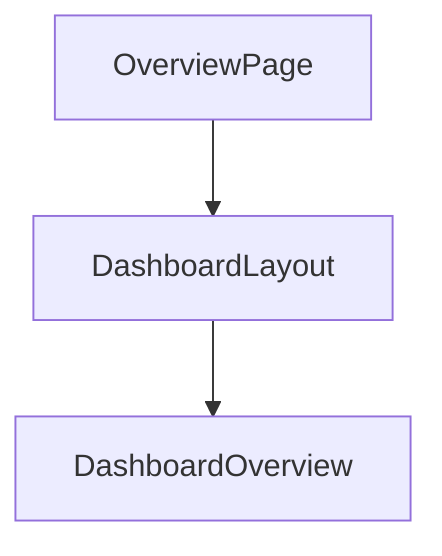

# app/dashboard/overview/page.tsx  
This file defines the **Overview** page of the Dashboard section. It composes a layout wrapper and a content component to render the overview UI in a Next.js App Router setup.

```tsx
import { DashboardLayout } from "@/components/dashboard-layout"
import { DashboardOverview } from "@/components/dashboard-overview"

export default function OverviewPage() {
  return (
    <DashboardLayout>
      <DashboardOverview />
    </DashboardLayout>
  )
}
```  
The `OverviewPage` component simply nests **DashboardOverview** inside **DashboardLayout** to ensure consistent navigation and styling .

## Key Imports  
| Import               | Source                              | Description                                       |
|----------------------|-------------------------------------|---------------------------------------------------|
| **DashboardLayout**  | `@/components/dashboard-layout`     | Provides sidebar, header, and responsive layout  |
| **DashboardOverview**| `@/components/dashboard-overview`   | Renders KPI cards, charts, and notifications  |

## Component Structure  
- **OverviewPage**  
  - Entry point for `/dashboard/overview`.  
  - Wraps content in a reusable layout.  
- **DashboardLayout**  
  - Manages sidebar navigation, mobile menu toggling, and page framing.  
  - Defines links to all dashboard sub-pages (Overview, ITC, Sales, etc.) .  
- **DashboardOverview**  
  - Displays a grid of KPI cards (tax liability, ITC claimed, net tax payable).  
  - Includes interactive charts and recent notices for a comprehensive snapshot .

## Routing & Usage  
- Placed under the App Router at `app/dashboard/overview/page.tsx`.  
- Automatically served at the URL path:  
  ```
  GET /dashboard/overview
  ```

## Dependencies & Relationships  
- Relies on the **App Router** (Next.js 13+) for file-based routing.  
- Uses Tailwind CSS and shadcn/ui components for styling consistency.  
- Integrates Lucide icons and Recharts via child components.  



> **Note**: No API endpoints are defined here; this file purely orchestrates layout and overview content.