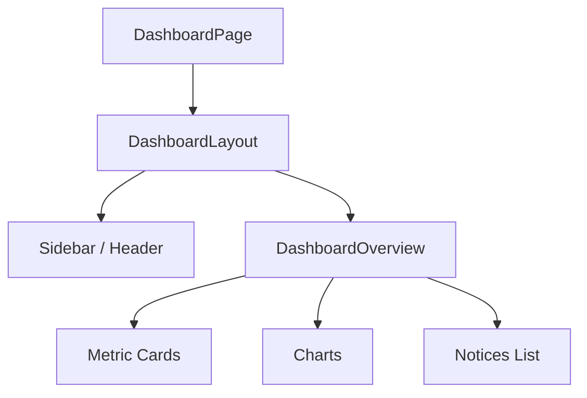

# DashboardPage Component Documentation

## Overview  
The **DashboardPage** component serves as the entry point for the `/dashboard` route. It composes two key pieces: a layout wrapper and the overview content.  

## Purpose  
- Renders the main dashboard view for authenticated users.  
- Ensures consistent layout (sidebar, header, footer) across all dashboard pages.  
- Hosts the **DashboardOverview** component to display high-level metrics.  

## File Location  
`app/dashboard/page.tsx`   

## Key Sections  

### 1. Imports  
| Module                                    | Description                                         |
|-------------------------------------------|-----------------------------------------------------|
| `DashboardLayout`                         | Layout wrapper for all dashboard pages             |
| `DashboardOverview`                       | Overview widget showing KPIs and charts            |

```ts
import { DashboardLayout } from "@/components/dashboard-layout"
import { DashboardOverview } from "@/components/dashboard-overview"
```  

### 2. Component Definition  
Defines a default export function that returns JSX.

```tsx
export default function DashboardPage() {
  return (
    <DashboardLayout>
      <DashboardOverview />
    </DashboardLayout>
  )
}
```  
- **DashboardLayout** wraps the content with navigation and responsive UI .  
- **DashboardOverview** injects the overview dashboard view .  

## Dependencies  
- **Next.js App Router**: Uses the file as a server-side component for routing.  
- **React**: Functional component using JSX.  
- **Custom Components**:  
  - `DashboardLayout` — handles sidebar, mobile menu, and theming.  
  - `DashboardOverview` — renders KPI cards, charts, and recent notices.  

## Component Tree  



> This flowchart outlines the parent–child relationship within the dashboard route.  

## Integration  
- Placed under `app/dashboard/`; Next.js maps it to `/dashboard`.  
- Sits alongside sibling routes (e.g., `overview`, `itc`, `sales`).  
- Shares the same layout for consistent navigation and styling.  

## Design Decisions  
- **Separation of Concerns**: Keeps layout logic in `DashboardLayout`, overview logic in `DashboardOverview`, and routing in this file.  
- **Reusability**: Other dashboard pages reuse the same layout wrapper.  
- **Simplicity**: Minimal routing file reduces boilerplate.  

---

**Note:** Any changes to the layout or overview components reflect here automatically, ensuring a single source of truth for dashboard behavior.